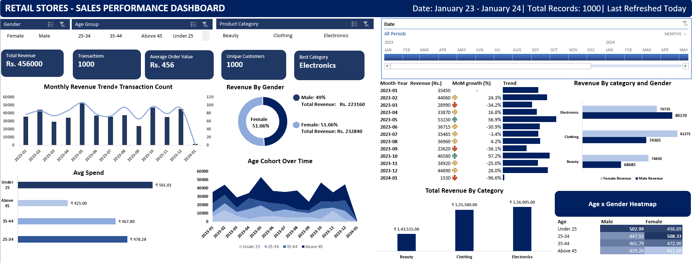

\# 🛒 Retail Sales Analysis

An end-to-end data analysis project covering customer behaviour profiling,

statistical testing, and an interactive Excel dashboard.

\---

\## 📊 Dashboard Preview

\---

\## 🔍 Key Analyses

\- Statistical Testing — Hypothesis testing to validate segment differences

\- EDA — Distribution analysis, outlier detection, correlation profiling

\- Excel Dashboard — Interactive slicers, charts, and KPI summaries

\---

\## 🛠️ Tools Used

| Tool | Purpose |

|------|---------|

| Python (Pandas, Matplotlib, Seaborn) | EDA and analysis |

| Microsoft Excel | Interactive dashboard |

| Microsoft Word | Analysis report |

\---

\## 💡 Key Findings

\- High-value customers contributed disproportionately to total revenue

\- Recency is a strong predictor of purchase value

\- Statistically significant differences found across customer segments

\---

\## 👩‍💻 Author

\*\*Soumi Maiti\*\* — MBA Candidate, Business Analytics, IISWBM Kolkata

\[LinkedIn]([www.linkedin.com/in/soumi-maiti-2k26](www.linkedin.com/in/soumi-maiti-2k26))

